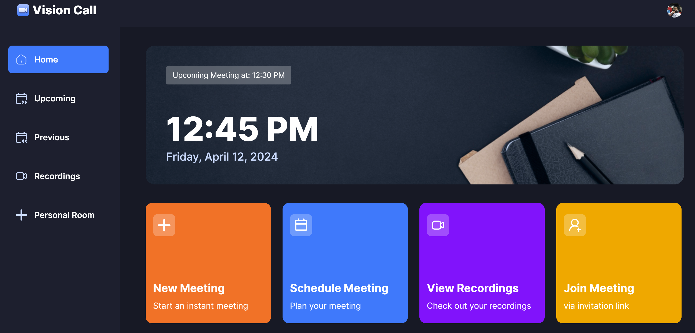

# VISION CALL VIDEO CONFERENCING APPLICATION

Here is an awesome video conferencing application built with the latest Next.js and Typescript, this project portrays a video conferencing tool just like the popular Zoom app.

It enables users to securely log in, create meetings, and access various meeting functionalities such as recording, screen sharing and managing participants

## Examples

Try out the demo here: https://vision-call.vercel.app/

## Tech Stack

| Type            | Tech                                      |
| --------------- | ----------------------------------------- |
| Language        | [JavaScript](https://www.javascript.com/) |
| Framework       | [Next.js](https://nextjs.org/)            |
| Styling         | [Tailwind CSS](https://tailwindcss.com/)  |
| Styling         | [Shadcn](https://ui.shadcn.com/)          |
| User Management | [Clerk](https://clerk.com/)               |
| Video Streaming | [getStream](https://getstream.io/)        |
| Hosting         | [Vercel](https://vercel.com)              |
